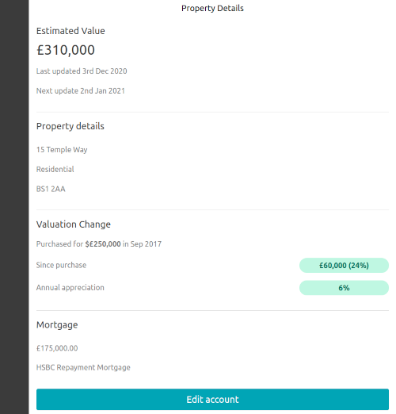

# Solution



## Detail

This component's main section has been split into components dedicated for 'Estimated Value', 'Property Details', and 'Mortgage', to facilitate readability and maintenance.

## AccountSection

The 'AccountSection' component was created to avoid including 'AccountLabel' for every section.

### HTML Semantics

Changed:
- `Inset = styled.div` to use a `main` element
- `AccountSection = styled.div` to use a `section` element
- `AccountListItem = styled.div` to use an `li` element
- `InfoText = styled.div` to use a `p` element

## Location of the `lastUpdate` definition

The below is an extract from the original code:
- the definition of `lastUpdate` is located between lines related to `mortgage` logic
- the definition of mortgage can be shortened and made more readable:

```
let mortgage;
  const lastUpdate = new Date(account.lastUpdate);  // not the ideal location
  if (account.associatedMortgages.length) {
    mortgage = account.associatedMortgages[0];
  }
```

This would have been better (I ended up not using this modified code):

```
const lastUpdate = new Date(account.lastUpdate);
  
const mortgage = account.associatedMortgages.length ? account.associatedMortgages[0] : undefined
 ```

## Import Order

I find giving some order to imports to be benefical, in this case changing the order of:
```
import { add, format } from "date-fns"
import React, { useEffect } from "react"
```
To:
```
import React, { useEffect } from "react"
import { add, format } from "date-fns"
```

This example might seem trivial, but imagine there are some Redux-related imports: I would place them on the second line. This would give an early idea of what the code is doing.

And to be really picky, another example:
```
import {
  AccountHeadline, AccountLabel, AccountList, AccountListItem, AccountSection, InfoText, Inset
} from "./style";
```

'Inset' is used in the code before 'AccountSection', and 'AccountSection' before 'AccountHeadline', I think the below would be an improvement:
```
import {
  Inset, AccountSection, AccountLabel, AccountHeadline, AccountList, AccountListItem, InfoText
} from "./style";
```
And ideally the order of the declaration of these components in the `modules/property-details/style.js` file follows some kind of similar ordering, I changed that accordingly.


## Given more time, what other changes you would have liked to make?

### TypeScript

TypeScript instead of PropTypes.

### State Management

State Management with a library such as Redux would not necessitate forwarding props to child components, such as:
```
<EstimatedValueSection
  amount={account.recentValuation.amount}
  lastUpdate={account.lastUpdate}
  updateAfterDays={account.updateAfterDays}
/>
```

This is resulting in more verbose code.

### Data Fetching

The api is being used to fetch account details, and a 'loader' component was introduced:
```
{!account && <p>Loading...</p>}
```

In a real setup a Redux thunk could take care of:
- the asynchronous data fetching
- the management the status of the loader
- constructing the 'accounts' object that is being saved in State (for this exercise, this is being done by 'utils/constructAccountDetails')

### The 'Change in Valuation' Component

Suggested imporvements for this component are:
- red shades to denote a depreciation in value
- the label 'Annual appreciation' to dynamically use 'Annual depreciation' in case of a depreciated value
- a graph to show the change in value over time

### Functions in the Utils Folder

In a real setup, these utility functions should cater for more edge cases, incorrect variable types, and error-handling.

### Formatting

A formatter was not used, so there are missing instances of ';' or single-quotes instead of 'double-quotes', etc.

### Date for 'recentValuation'

The date when the recentValuation was carried out is not available, it is assumed to be today.

### Responsiveness of the HighlighItem component

On small screens, the components created for the 'Valuation Change' section could resize better on small screens.

## What UX or design improvements or alterations might you suggest? These can be to existing components or completely new ideas.

- The 'Edit account' button might be out of view if sufficient details force it down and off the screen. Ideally tools are never 'a scroll away'.

- Most probably the user would already be familiar with the Property Details, ideally this is moved further down or turned into a collapsible component.


